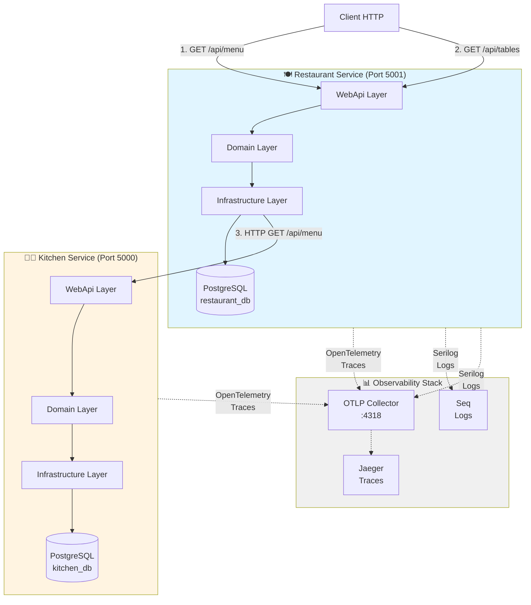
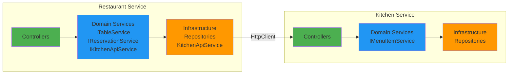
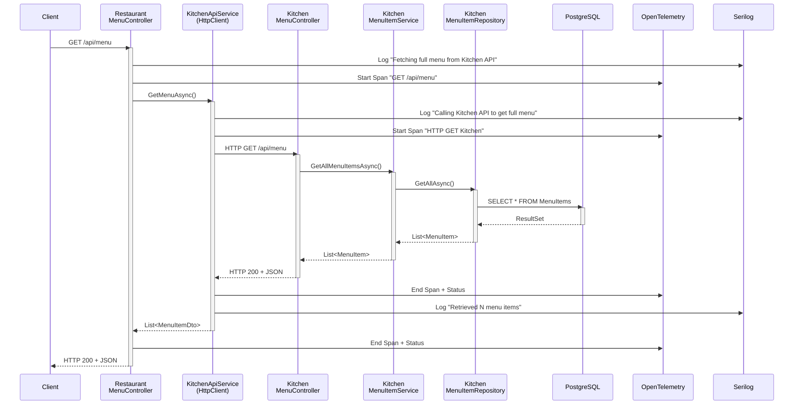

# Architettura Microservizi - Restaurant & Kitchen

## Diagramma Flusso delle Chiamate



## Dettaglio Architettura Esagonale



## Flusso Dettagliato: Client → Restaurant → Kitchen



## Stack Tecnologico

### Restaurant Service
- **Framework**: .NET 8.0 Web API
- **Database**: PostgreSQL (restaurant_db)
- **Logging**: Serilog (Console, File, Seq, OpenTelemetry)
- **Tracing**: OpenTelemetry
- **Pattern**: Hexagonal Architecture (3 layers)
- **Port**: 5001

**Entità**:
- Table (TableNumber, Capacity, Status, Location)
- Reservation (CustomerName, Email, DateTime, Status)

**Funzionalità**:
- Gestione tavoli
- Gestione prenotazioni
- Proxy per menu da Kitchen API

### Kitchen Service
- **Framework**: .NET 8.0 Web API
- **Database**: PostgreSQL (kitchen_db)
- **Logging**: Console
- **Tracing**: OpenTelemetry
- **Pattern**: Hexagonal Architecture (3 layers)
- **Port**: 5000

**Entità**:
- MenuItem (Name, Description, Price, Category, Allergens, IsAvailable, etc.)

**Funzionalità**:
- CRUD menu items
- Filtri per categoria, allergie, disponibilità

### Console App
- **Framework**: .NET 8.0 Console
- **Tracing**: OpenTelemetry (custom ActivitySource)
- **Metrics**: OpenTelemetry (custom Meter)

## Distributed Tracing

OpenTelemetry traccia automaticamente:

1. **HTTP Requests** (ASP.NET Core Instrumentation)
   - Ogni chiamata REST viene tracciata
   - Propagazione automatica del `traceparent` header

2. **HTTP Client Calls** (HttpClient Instrumentation)
   - Le chiamate da Restaurant → Kitchen vengono tracciate
   - Correlazione automatica tra i servizi

3. **Database Queries** (EF Core Instrumentation)
   - Query SQL tracciate con parametri
   - Tempo di esecuzione registrato

4. **Custom Spans** (ActivitySource)
   - Possibilità di aggiungere span personalizzati
   - Attributi custom per business logic

### Esempio Trace Distribuita

```
TraceID: 1234567890abcdef

Span 1: GET /api/menu (Restaurant) [200ms]
  │
  ├─ Span 2: KitchenApiService.GetMenuAsync [180ms]
  │   │
  │   └─ Span 3: HTTP GET http://localhost:5000/api/menu [170ms]
  │       │
  │       ├─ Span 4: MenuController.GetAllMenuItems (Kitchen) [165ms]
  │       │   │
  │       │   └─ Span 5: MenuItemService.GetAllMenuItemsAsync [160ms]
  │       │       │
  │       │       └─ Span 6: PostgreSQL SELECT MenuItems [150ms]
```

## Serilog Structured Logging

### Restaurant Service - 4 Sinks

1. **Console**: Output colorato per sviluppo
2. **File**: Rotazione giornaliera in `logs/ristorante-{Date}.log`
3. **Seq**: Dashboard web per query sui log
4. **OpenTelemetry**: Correlazione log-trace via OTLP

### Esempio Log Correlato

```json
{
  "Timestamp": "2025-11-02T10:30:45.123Z",
  "Level": "Information",
  "MessageTemplate": "Calling Kitchen API to get full menu",
  "TraceId": "1234567890abcdef",
  "SpanId": "abcdef1234567890",
  "ServiceName": "Restaurant.WebApi",
  "MachineName": "dev-machine",
  "ThreadId": 42
}
```

## Come Eseguire l'Architettura

### 1. Avvia l'infrastruttura (Docker)

```bash
docker-compose up -d postgres jaeger seq
```

### 2. Avvia Kitchen Service

```bash
cd Kitchen/src/Kitchen.WebApi
dotnet run
# Listening on http://localhost:5000
```

### 3. Avvia Restaurant Service

```bash
cd Restaurant/src/Restaurant.WebApi
dotnet run
# Listening on http://localhost:5001
```

### 4. Test chiamata distribuita

```bash
# Il Restaurant chiama automaticamente Kitchen
curl http://localhost:5001/api/menu

# Oppure chiama direttamente Kitchen
curl http://localhost:5000/api/menu
```

### 5. Visualizza telemetria

- **Jaeger UI**: http://localhost:16686 (traces distribuite)
- **Seq UI**: http://localhost:5341 (log strutturati)

## Vantaggi Architettura

✅ **Separation of Concerns**: Ogni layer ha responsabilità ben definite
✅ **Testability**: Domain logic isolata dall'infrastruttura
✅ **Observability**: Trace e log correlati automaticamente
✅ **Scalability**: Servizi indipendenti scalabili separatamente
✅ **Resilience**: Gestione errori quando Kitchen non è disponibile
✅ **Maintainability**: Architettura esagonale facilita modifiche
